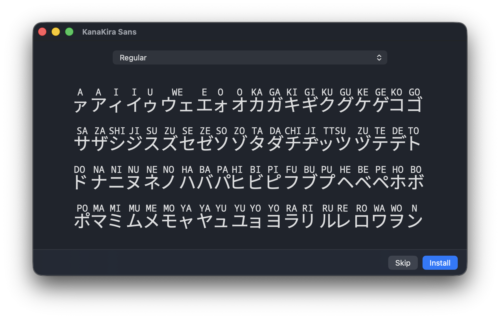

# KanaKira

**A unique Japanese learning font that displays Romaji above Katakana characters**

Perfect for Japanese language students, educators, and anyone learning to read Katakana! KanaKira Sans shows you both
the Katakana character and its pronunciation in one beautiful, easy-to-read font.

*Example: When you type アリガトウ, you'll see "A", "RI", "GA", "TO", "U" displayed above each character*



## ✨ What makes KanaKira special?

- **Learn faster**: See pronunciation while reading Katakana
- **Beautiful design**: Clean, readable typography based on Google's Noto fonts
- **Complete coverage**: All Katakana characters including combinations (キャ, ッチ, etc.)
- **Ready to use**: Works in any app that supports TrueType fonts

## 📥 For Users

### Step 1: Get the Font

**Option A: Download Pre-built Font (Recommended)**

Download the latest `KanaKiraSans-*.zip` from
the [Releases Page](https://github.com/satoi8080/KanaKira/releases) - no build required!
Unzip it to get `KanaKiraSans-Regular.ttf` alongside `OFL.txt`, the font's license.

### Step 2: Install the Font

Once you have `KanaKiraSans-Regular.ttf`:

- **Windows**: Right-click → "Install"
- **Mac**: Double-click → "Install Font"
- **Linux**: Copy to `~/.fonts/` or `/usr/share/fonts/`

## 🎯 How to Use

Once installed, KanaKira Sans works like any other font:

- **In Word processors**: Type Katakana and see Romaji appear above automatically
- **In learning apps**: Perfect for flashcards and study materials
- **On websites**: Use with CSS `font-family: 'KanaKira Sans'`
- **In presentations**: Great for teaching materials

**Example text to try:** アリガトウゴザイマス (Thank you very much!)

## 📚 What's Included

KanaKira Sans covers all Katakana characters you need:

**Basic Characters**: ア イ ウ エ オ カ キ ク...  
**Voiced Sounds**: ガ ギ グ ゲ ゴ ザ ジ ズ...  
**Small Characters**: ァ ィ ゥ ェ ォ ッ ャ ュ ョ  
**Combinations**: キャ シュ チョ ニャ...  
**Double Consonants**: ッカ ッキ ック...  
**Special Characters**: ー ヴ ン

## 🛠️ For Developers

### Build from Source

Build the font from source (it's easier than it sounds!):

**Requirements:**

- Python 3.12+
- [uv](https://docs.astral.sh/uv/) (Recommended for dependency management)

**Build Steps:**

1. Clone and setup:
   ```bash
   git clone https://github.com/satoi8080/KanaKira.git
   cd KanaKira
   uv sync
   ```

2. Build the font:
   ```bash
   uv run main.py
   ```

3. Find your font: `KanaKiraSans-Regular.ttf` will be created in the project folder

### Development Setup (Optional)

If you want to contribute to the project, set up the development environment:

```bash
uv run pre-commit install
```

This will ensure code is automatically formatted and checked before each commit.

## ⚙️ Customization

Want to adjust the font? Edit `config.json` to change:

- Romaji size and positioning
- Katakana scaling
- Vertical spacing between characters
- Font naming

Then rebuild with `uv run main.py`

## 🔬 Technical Details

Built with love using:

- **Base fonts**: Google's Noto Sans JP + Noto Sans Mono
- **Technology**: Python + FontTools library
- **Format**: TrueType (.ttf) with OpenType ligature features
- **Encoding**: Full Unicode support

## 💡 Inspiration

This project was inspired by [Cantonese Font](https://canto.hk/), a beautifully designed font that displays Jyutping
above Chinese characters. KanaKira adapts this concept for Japanese learners using Katakana and Romaji.

## 📄 License

This repository is licensed in two parts:

- **The font** (KanaKira Sans): [SIL Open Font License 1.1](OFL.txt). It is built from
  Noto Sans JP and Noto Sans Mono, also under OFL 1.1; the OFL requires derivative
  fonts to stay under the OFL. Free to use in any project, including commercially —
  just keep the license notice with the font and don't sell the font by itself.
- **Source code and build tooling**: [MIT](LICENSE).

## 🤝 Contributing & Support

- **Found a bug?** [Open an issue](https://github.com/satoi8080/KanaKira/issues)
- **Have ideas?** [Start a discussion](https://github.com/satoi8080/KanaKira/discussions)
- **Want to contribute?** Pull requests welcome!

---

**Made with ❤️ for Japanese learners worldwide**  
*Perfect for students, teachers, and typography enthusiasts*